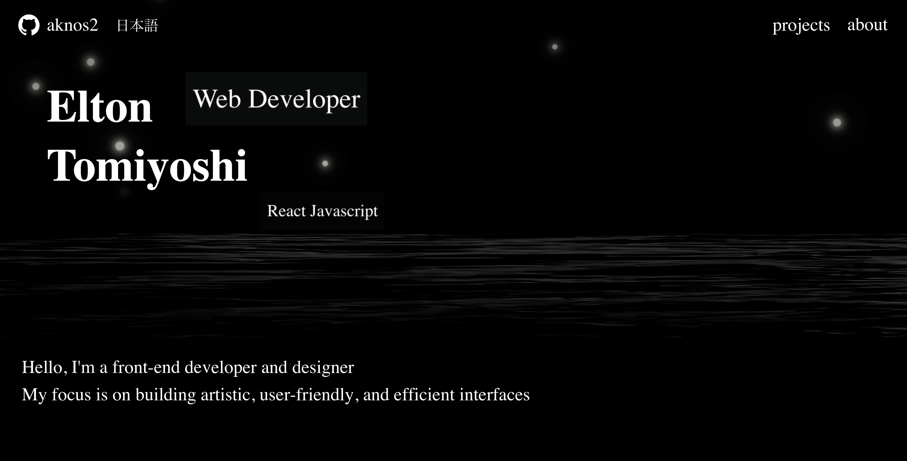
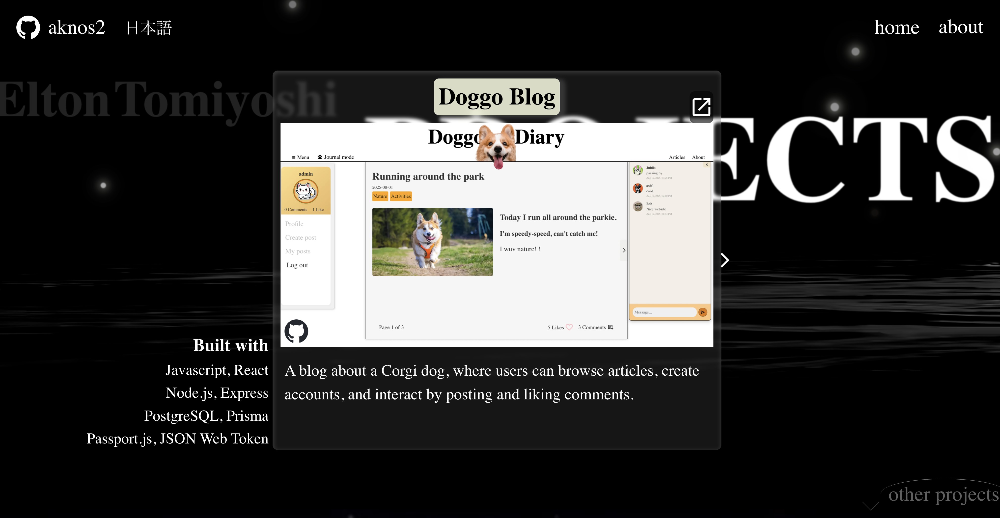
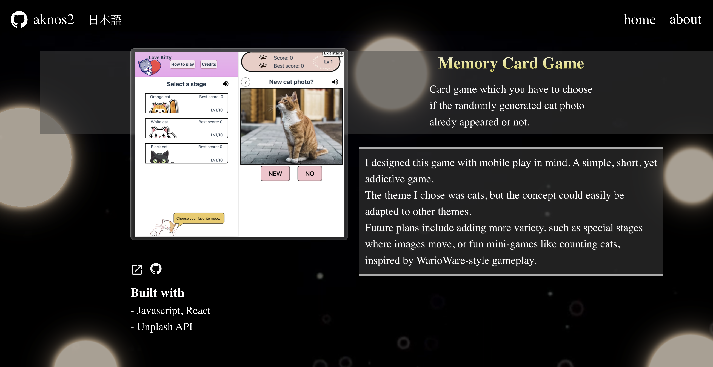

# portfolio

My portfolio built with React, Javascript, and GSAP.
The website provides information about the projects I have built so far.
Created animations and a stylistic style to make the page look elegant. The projects page uses scroll trigger to create a feeling that you are going under water as you scroll down. Used other effects to make the pages have a 3D depth look.

## Website Url

https://portfolio.eltontomiyoshi.workers.dev

## Screenshots

## Platform

- Cloudflare
